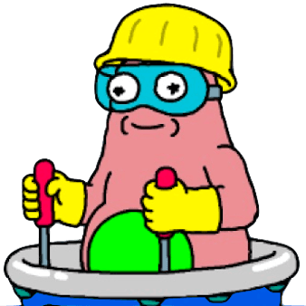
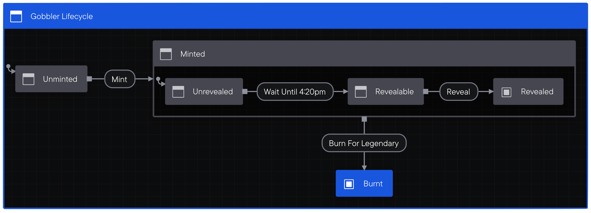
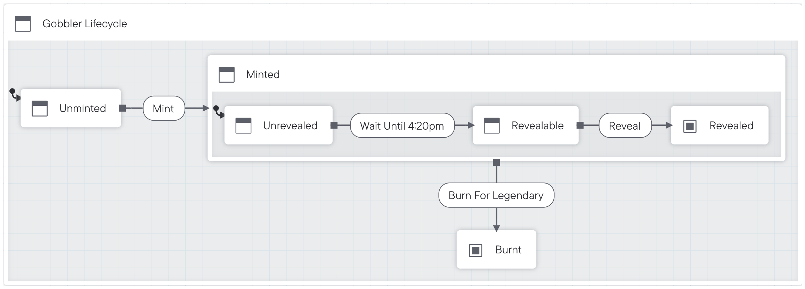
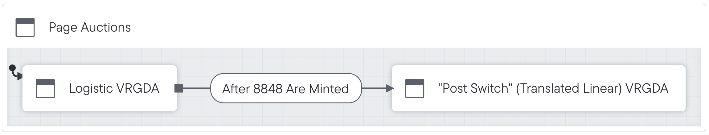

# Art Gobblers • [](https://github.com/artgobblers/art-gobblers/actions/workflows/tests.yml)

Art Gobblers is an experimental decentralized art factory by Justin Roiland and Paradigm.

## Background

Art Gobblers is a decentralized art factory owned by aliens. As artists make cool art, Gobblers gains cultural relevance, making collectors want the art more, incentivizing artists to make cooler art. It's also an on-chain game.

See our [overview of the system](https://www.paradigm.xyz/2022/09/artgobblers), as well as deep dives into some the project's mechanisms, like [GOO](https://www.paradigm.xyz/2022/09/goo) and [VRGDAs](https://www.paradigm.xyz/2022/08/vrgda).

## Deployments

TBD

## State Diagrams







## Usage

You will need a copy of [Foundry](https://github.com/foundry-rs/foundry) installed before proceeding. See the [installation guide](https://github.com/foundry-rs/foundry#installation) for details.

To build the contracts:

```sh
git clone https://github.com/artgobblers/art-gobblers.git
cd art-gobblers
forge install 
```

### Run Tests

In order to run unit tests, run: 

```sh
forge test
```

For longer fuzz campaigns, run: 

```sh
FOUNDRY_PROFILE="intense" forge test
```

For differential fuzzing against a python implementation, see [here](./analysis/README.md).

### Run Slither 

After [installing Slither](https://github.com/crytic/slither#how-to-install), run: 

```sh
slither src/ --solc-remaps 'ds-test/=lib/ds-test/src/ solmate/=lib/solmate/src/ forge-std/=lib/forge-std/src/ chainlink/=lib/chainlink/contracts/src/ VRGDAs/=lib/VRGDAs/src/ goo-issuance/=lib/goo-issuance/src/'
```


### Update Gas Snapshots

To update the gas snapshots, run: 

```sh
forge snapshot
```

## Audits

The following auditors were engaged to review the project before launch:

- [samczsun](https://samczsun.com) (No report)
- [Spearbit](https://spearbit.com) (Report pending)
- [code4rena](https://code423n4.com) (Audit pending)
- [Riley Holterhus](https://www.rileyholterhus.com) (No Report)

## License

[MIT](LICENSE) © 2022 Art Gobblers
