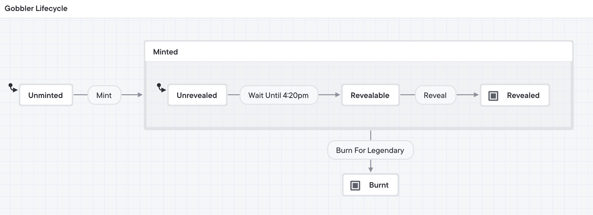

# Art Gobblers (Smart Contracts) • [](https://github.com/FrankieIsLost/art-gobblers/actions/workflows/CI.yml)

Art Gobblers scan the cosmos in search of art producing life.




## Contributing

You will need a copy of [Foundry](https://github.com/gakonst/foundry) installed before proceeding. See the [installation guide](https://github.com/gakonst/foundry#installation) for details.

### Setup

```sh
git clone https://github.com/FrankieIsLost/art-gobblers.git
cd art-gobblers
```

### Run Tests

```sh
forge test
```

### Update Gas Snapshots

```sh
forge snapshot
```
